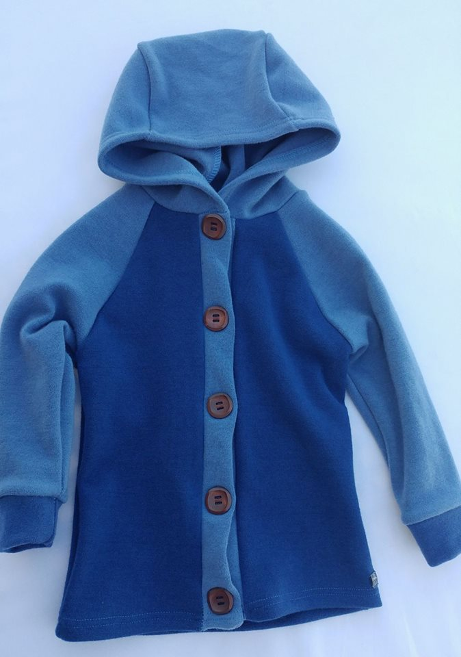

# How To Make an SVG for the Bumby Builder
This is a guide on how to make an svg for use with the Bumby Builder code

## Example 1 - SVG Basics
Take a look at the `example1.html` file which has an SVG that draws a blue square with a purple border
Here's the SVG code
```
<svg viewBox="0 0 375 500" style="width: 375px;">
    <polygon id="square" points="10,10 365,10 365,490 10,490" style="fill:blue;stroke:purple;stroke-width:10;"></polygon>
</svg>
```
This SVG has a width of 375 pixels and a heigh of 500 pixels. That is the default width and height we will use for all of the SVGs in the Bumby Builder.
> 375px X 500px aligns to a standard picture frame ratio of 18:24

Nested inside the `<svg>` element is a `<polygon>` element that defines the square which was drawn. The polygon has a `points` attribute which defines the lines to draw for that polygon. Each point is written as X,Y with a space in between each point. 
> Think of the SVG as a grid where the point 0,0 is top left corner and the point 375,500 is the bottom right corner

The `<polygon>` in example 1 has 4 points so the SVG will draw a line, called a `stroke`, between each point. the properties of the `stroke` are defined in the `style` attribute of the `<polygon>`. Additionally, the `fill` property determines the color to paint the interior space of the `<polygon>`.

## Example 2 - Multiple Polygons
In `example2.html` you can see that we have the same SVG but now with two polygons defined. One polygon fills the top half of the SVG with blue and the other polygon fills the bottom half with red.
```
<svg viewBox="0 0 375 500" style="width: 375px;">
    <polygon id="topSquare" points="10,10 365,10 365,240 10,240" style="fill:blue;stroke:purple;stroke-width:10;"></polygon>
    <polygon id="bottomSquare" points="10,240 365,240 365,490 10,490" style="fill:red;stroke:purple;stroke-width:10;"></polygon>
</svg>
```
This is how in the Bumby Builder we can show clothing items with different colored sections. To make an SVG that draws a sweater you could use one polygon with all the points to draw the sweater's shape; however, for the Bumby Builder any section of a sweater which the customer can choose a color for has to be its own polygon.
> In the finished SVGs the strokes of polygon also show a more realistic image of the sweater as they represent some of the seams in the clothing.

## Example 3 - Tips for making SVGs for the Bumby Builder
The `example3.html` file shows a full example of what an sweater SVG might be like. The following sections contain tips on how to construct a SVG for use in the Bumby Builder.

### Picking Points Over an Existing Image
One way to make drawing the sections easier by tracing an existing image. On line 23 of the `example3.html` file you can see an example image that is commented out. Replace that line with the line below to see what this can look like.
```

```
Now you can the image shows up behind the SVG which is an effective way to help you find the right points to use for the different sections

### Strokes
With the finished SVG you'll want the strokes to appear as clothing seams by using the following style attribute on the polygon.
```
style="stroke:#000;stroke-width:2;stroke-opacity: 0.3;"
```
That style looks nice but isn't very helpful while you are trying to create the SVG so I recommend using a much clearer stroke like the following while you are creating the SVG. Once you have the strokes and fills working the way you want switch them to the one above for the finished look.
```
style="stroke:purple;stroke-width:3;"
```

* using darkening to create shadow areas
* optional sections

## Using the SVG Template file
* use of template page